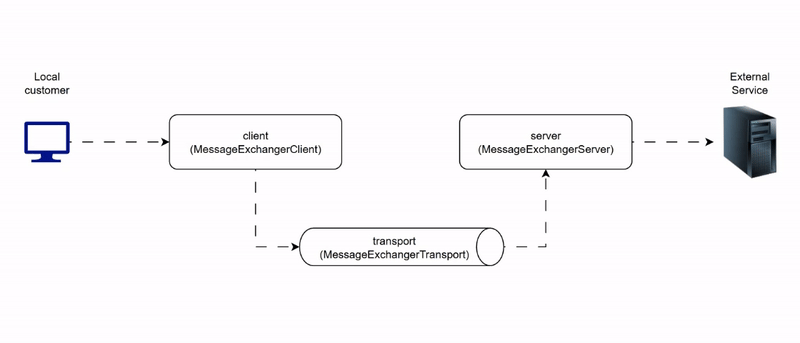

# TCP tunnel

This repository provides a transport-agnostic TCP tunnel implementation, allowing you to abstract the underlying transport method. Possible transport layers include sockets, WebSockets, IPC, and more.

## Implementation

The core functionality can be found in `message_exchanger.py`, which handles data exchange and transport logic.

## Examples

For usage demos, check out the `examples` folder. It shows various real-world scenarios where you can apply this tunnel mechanism.
